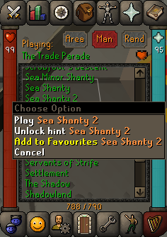
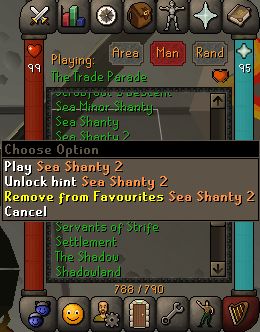
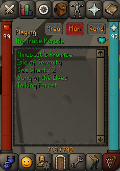
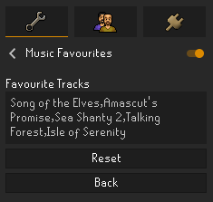

# Music Favourites

This plugin allows RuneLite users to easily mark and view their favourite OSRS music tracks.

## Usage

To favourite a track, right-click and select the <b>Add to Favourites</b> option. 
To unfavourite a track, right-click again and select the <b>Remove from Favourites</b> option.

&nbsp;&nbsp;&nbsp;&nbsp;&nbsp;&nbsp;&nbsp;&nbsp;&nbsp;&nbsp;

To view your favourites, click the <b>View Favourites</b> toggle button.

&nbsp;&nbsp;&nbsp;&nbsp;&nbsp;&nbsp;&nbsp;&nbsp;&nbsp;&nbsp;

## Configuration

Your list of favourited tracks is stored in the plugin's configuration settings.
You can easily share your favourites by copying them, or import another player's favourites by pasting their list into your config.

