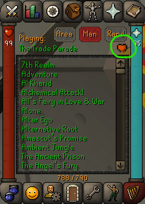

# Music Favourites

This plugin allows RuneLite users to easily mark and view their favourite OSRS music tracks.
Favourited tracks can be viewed as a separate list within Music Player tab.

## Usage

Install and enable the Music Favourites plugin from the Plugin Hub.

To favourite a tune, right-click and select the "Add to Favourites" option. 
To unfavourite, simply right-click again and choose "Remove from Favourites".

&nbsp;&nbsp;&nbsp;&nbsp;&nbsp;&nbsp;&nbsp;&nbsp;&nbsp;&nbsp;

To view your favourites, click the "View Favourites" toggle button.

&nbsp;&nbsp;&nbsp;&nbsp;&nbsp;&nbsp;&nbsp;&nbsp;&nbsp;&nbsp;

Favourites are persisted in the plugin's configuration settings.

